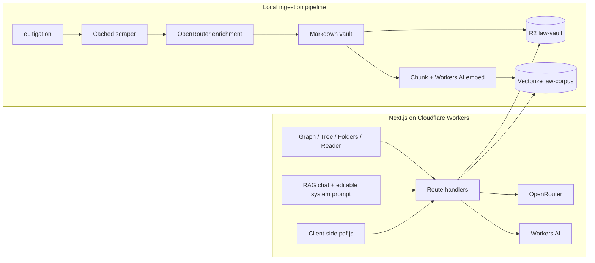

# Singapore Law Atlas

**Singapore Law Atlas** is a graph-first research workspace for Singapore **written law** (Constitution, Penal Code, Civil Law Act, and other principal Acts) and **case law**. Explore authorities as a connected graph, open statute digests with section maps, follow precedent links, ask citation-grounded questions, and spot liability issues in deposition or affidavit PDFs.

Live demo: [one-ai-hackathon.edmundlim.workers.dev](https://one-ai-hackathon.edmundlim.workers.dev)

Repository: [github.com/EdmundLimBoEn/Singapore-Law-Atlas](https://github.com/EdmundLimBoEn/Singapore-Law-Atlas)

> Research aid only. It is not legal advice. Verify every authority against the official text on [Singapore Statutes Online](https://sso.agc.gov.sg) or eLitigation, and check for later appellate treatment.

## Product surface

| Surface | What you get |
| --- | --- |
| **Graph** | Force-directed map of domains (Legislation, Civil law, Criminal justice, Public law). Click **Singapore law** to open the written-law overview. |
| **Tree / Folders** | Hierarchical browse by legal domain → topic → judgment or statute. |
| **Reader** | Summary, relevant laws & sections, expandable full text, footer quick summary, SSO / eLitigation link. |
| **Atlas counsel** | RAG chat over the corpus. Gear icon opens the **model system prompt** so you can view and tweak it live (saved in the browser). |
| **Deposition analysis** | Client-side PDF/text extraction and liability issue spotting against the atlas. |

## Written law first

The **Legislation** domain is not an afterthought. It includes:

1. **Singapore written law — overview of codes and principal Acts** (entry point when you click the red **Singapore law** hub)
2. **Criminal codes** — Penal Code 1871, CPC 2010, Misuse of Drugs Act, Computer Misuse Act, PCA, Road Traffic Act, Evidence Act
3. **Constitution & public law** — Constitution, Application of English Law Act, Interpretation Act
4. **Civil & commercial** — Civil Law Act, Companies Act, IRDA, IAA, Defamation Act, POHA, PDPA
5. **Family / employment / property** — Women’s Charter, Employment Act, WSHA, BMSMA, Land Titles Act
6. **Procedure** — Supreme Court of Judicature Act, Evidence Act

Judgments remain linked **from** those statutes so research can start with the section and move to the case.

## Architecture



Production bindings (`wrangler.jsonc`):

- `LAW_VAULT` → R2 bucket `law-vault`
- `LAW_CORPUS` → 768-dimension cosine Vectorize index `law-corpus`
- `AI` → Workers AI
- `OPENROUTER_API_KEY` → Wrangler secret (never committed)

## Local setup

Requirements: **Bun 1.3+**, a Cloudflare account for remote features, and optionally an OpenRouter key.

```bash
bun install
cp .dev.vars.example .dev.vars
# Add OPENROUTER_API_KEY to .dev.vars for live LLM responses.
bun dev
```

Open [http://localhost:3000](http://localhost:3000). The app lands on the **written-law overview**. Click the red **Singapore law** node anytime to return there.

Checked-in fixtures plus the bundled written-law corpus power browsing, search, chat, and deposition analysis when cloud bindings are unavailable.

## Tweaking the model prompt

1. Open **Ask the atlas** (⌘J / chat dock).
2. Click the **gear** icon in the chat header.
3. Edit the **Model system prompt** textarea.
4. Changes persist in `localStorage` (`sla-rag-system-prompt-v2`) and are sent as `systemPrompt` on each `/api/chat` request.
5. **Reset** restores `DEFAULT_RAG_SYSTEM_PROMPT` from `src/lib/server/prompts.ts`.

Default prompt behaviour: non-sycophantic / non-human tone, statute-first answers, paper-analysis framework (what it is / applicability / use / precedents), no invented authorities, and **inline `[[docId|label]]` wikilinks** so every mid-answer cite opens the paper (not only the footer chips). The client also linkifies bare neutral citations such as `[2007] SGCA 37` when the model forgets the wikilink form.

## Corpus pipeline

Offline deterministic pass:

```bash
bun pipeline/scrape.ts --offline
bun pipeline/enrich.ts --offline
bun pipeline/overviews.ts --offline
bun pipeline/index.ts
bun pipeline/upload.ts --dry-run
bun pipeline/embed.ts --dry-run
```

Refresh the demo judgment list from cached SGCA/SGHC raw files:

```bash
bun pipeline/build-demo-corpus.ts
```

Live workflow:

```bash
bun pipeline/scrape.ts --pilot --delay-ms 1500
bun pipeline/scrape.ts --target 300 --recent-pages 40 --delay-ms 1500
bun pipeline/enrich.ts --concurrency 2
bun pipeline/overviews.ts --llm
bun pipeline/index.ts
bun pipeline/upload.ts --bucket law-vault
bun pipeline/embed.ts --index law-corpus --dimensions 768
```

Details: [`pipeline/README.md`](pipeline/README.md).

## API

| Method | Path | Body / notes |
| --- | --- | --- |
| `GET` | `/api/index/graph` \| `tree` | Graph or folder index |
| `GET` | `/api/doc/:id` | Markdown document (statutes include full digests) |
| `POST` | `/api/search` | `{ "query", "topK?" }` |
| `POST` | `/api/chat` | `{ "messages", "systemPrompt?", "topK?" }` — SSE stream + citations |
| `POST` | `/api/deposition` | `{ "text", "filename?" }` |

## Verification

```bash
bun test
bun run lint
bun run typecheck
bun run build
```

## Deploy (Cloudflare)

```bash
bunx wrangler r2 bucket create law-vault
bunx wrangler vectorize create law-corpus --dimensions=768 --metric=cosine
bunx wrangler secret put OPENROUTER_API_KEY
bun run deploy
```

## Demo path (release)

1. Land on **Singapore written law — overview of codes and principal Acts**.
2. Click the red **Singapore law** hub (or Legislation) to re-open that overview.
3. Open **Penal Code 1871** or **Civil Law Act 1909** from the statute map.
4. Follow a related judgment (e.g. Spandeck) and inspect backlinks.
5. Open Atlas counsel → gear → inspect/tweak the system prompt → ask a duty-of-care or s 112 question.
6. Run Deposition Analysis on a sample PDF and jump back into a flagged authority.

## Project layout (high signal)

```
src/
  components/atlas/     # Graph, reader, chat (prompt editor), deposition
  components/atlas/lib/
    singapore-statutes.ts   # Written-law corpus + overview
    demo-corpus.ts          # Curated judgments + merge
    guide-docs.ts           # Root/domain click → document mapping
  lib/server/prompts.ts     # DEFAULT_RAG_SYSTEM_PROMPT (editable in UI)
  fixtures/                 # Offline graph/tree + recent judgments
pipeline/                   # Scrape → enrich → index → R2 / Vectorize
```

## Licence & disclaimer

Hackathon / research software. No warranty. Not a substitute for qualified Singapore legal advice.
