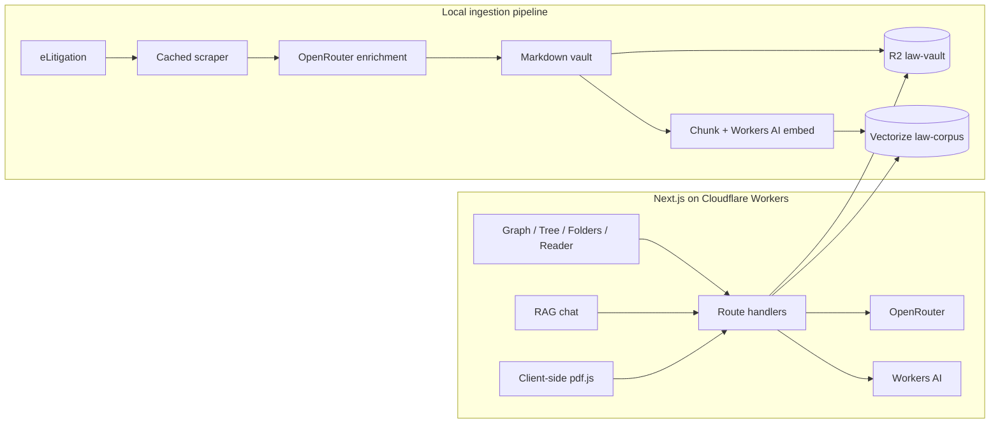

# Singapore Law Atlas

Singapore Law Atlas is a graph-first research workspace for exploring Singapore judgments, following precedent links, asking citation-grounded questions, and spotting liability issues in deposition or affidavit PDFs.

Live demo: [one-ai-hackathon.edmundlim.workers.dev](https://one-ai-hackathon.edmundlim.workers.dev)

> Research aid only. It is not legal advice. Verify every authority against the official judgment and check for later appellate treatment.

## What is included

- Obsidian-style force graph as the default view, plus topic tree and folder explorer
- Markdown judgment reader with wikilinks, backlinks, tags, and related precedents
- RAG search/chat backed by Workers AI embeddings and Cloudflare Vectorize
- Client-side PDF extraction; only extracted text is submitted for issue analysis
- Resumable local corpus pipeline for scraping, enrichment, overviews, indexing, R2 upload, and embedding
- Offline fixtures and local fallbacks, so the complete demo works without cloud secrets

## Architecture



The production bindings are declared in `wrangler.jsonc`:

- `LAW_VAULT` → R2 bucket `law-vault`
- `LAW_CORPUS` → 768-dimension cosine Vectorize index `law-corpus`
- `AI` → Workers AI
- `OPENROUTER_API_KEY` → Wrangler secret (never committed)

## Local setup

Requirements: Bun 1.3+, a Cloudflare account for remote features, and optionally an OpenRouter key.

```bash
bun install
cp .dev.vars.example .dev.vars
# Add OPENROUTER_API_KEY to .dev.vars for live LLM responses.
bun dev
```

The checked-in fixture corpus powers document browsing, semantic-like local search, chat, and deposition issue cards when bindings or secrets are unavailable.

## Corpus pipeline

Run a deterministic offline pass first:

```bash
bun pipeline/scrape.ts --offline
bun pipeline/enrich.ts --offline
bun pipeline/overviews.ts --offline
bun pipeline/index.ts
bun pipeline/upload.ts --dry-run
bun pipeline/embed.ts --dry-run
```

Then use the resumable live workflow:

```bash
bun pipeline/scrape.ts --pilot --delay-ms 1500
bun pipeline/scrape.ts --target 300 --recent-pages 40 --delay-ms 1500
bun pipeline/enrich.ts --concurrency 2
bun pipeline/overviews.ts --llm
bun pipeline/index.ts
bun pipeline/upload.ts --bucket law-vault
bun pipeline/embed.ts --index law-corpus --dimensions 768
```

See [`pipeline/README.md`](pipeline/README.md) for credentials, rate-limit behavior, cache/resume semantics, and safe dry runs.

## API surface

- `GET /api/index/graph|tree`
- `GET /api/doc/:id`
- `POST /api/search` with `{ "query": "...", "topK": 8 }`
- `POST /api/chat` with `{ "messages": [{ "role": "user", "content": "..." }] }`, returning citation metadata and streamed SSE deltas
- `POST /api/deposition` with `{ "text": "...", "filename": "..." }`

## Verification

```bash
bun test
bun run lint
bun run typecheck
bun run build
bunx opennextjs-cloudflare build
bun run preview
```

## Cloudflare deployment

The resources can be created idempotently with Wrangler:

```bash
bunx wrangler r2 bucket create law-vault
bunx wrangler vectorize create law-corpus --dimensions=768 --metric=cosine
bunx wrangler secret put OPENROUTER_API_KEY
bun run deploy
```

The ingestion and query paths both enforce a 768-dimension contract, falling back from `@cf/baai/bge-m3` to `@cf/baai/bge-base-en-v1.5` when required.

## Demo flow

1. Open the default graph and focus the Negligence cluster.
2. Open the topic overview, then the Spandeck judgment.
3. Inspect backlinks and related precedents.
4. Ask when a duty of care arises in Singapore.
5. Open Deposition Analysis, upload a sample, and follow a flagged precedent back into the atlas.
